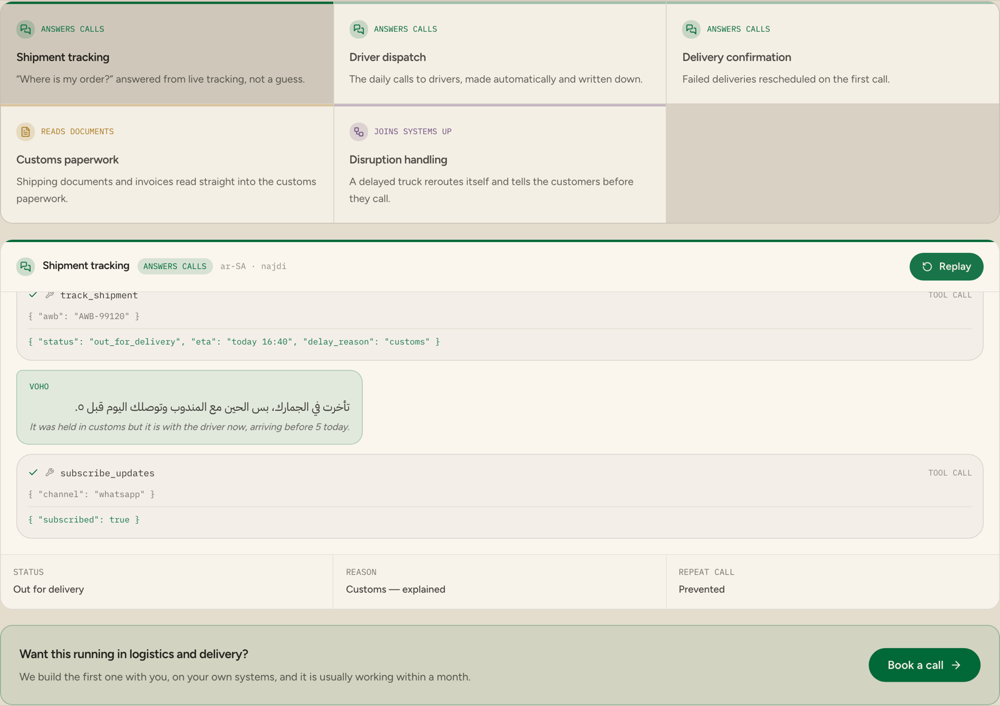

# Saudi Logistics Voice Agent

> A free Arabic voice agent for Saudi logistics operators — driver calls, delivery windows and status updates in Najdi Arabic, self-hosted.

**Free, MIT licensed, and built to run on your own infrastructure.** No seats,
no per-agent pricing, nothing calling home. `docker compose up` and it is
running inside your network.

<p align="center">
  <a href="https://voho.ai/industries/logistics">
    
  </a>
</p>

<p align="center">
  <b><a href="https://voho.ai/industries/logistics">▶ Play the live demo</a></b> — runs in your browser, no sign-up.
</p>

---

## The problem

Drivers calling dispatch from the road while dispatch is already on another call, and the customer hears nothing.

This is for last-mile fleets, 3PLs and dispatch teams. Every conversation is in **Najdi Arabic** — the
dialect of Riyadh and central Saudi Arabia — and every one ends in something
happening in a real system, not in a promise that somebody will call back.

## What it does out of the box

| Scenario | | |
| --- | --- | --- |
| `track` | Shipment tracking | “Where is my order?” answered from live tracking, not a guess. |
| `dispatch` | Driver dispatch | The daily calls to drivers, made automatically and written down. |
| `delivery` | Delivery confirmation | Failed deliveries rescheduled on the first call. |

Play any of them right now, before you have connected anything:

```bash
python examples/play.py track
```

The tools (`assign_route`, `reschedule_delivery`, `subscribe_updates`, `track_shipment`) replay the results recorded with each scenario, so the
whole conversation runs on an empty machine. Connecting a system means
replacing one stub at a time.

### Also included as reference scenarios

| Scenario | | |
| --- | --- | --- |
| `customs` | Customs paperwork | a hard document read into fields |
| `disruption` | Disruption handling | an event carried across several systems |

These are not conversations, so the engine does not play them — they are the recorded shape of the document, the archive answer or the workflow, kept here because they are the same job in the same sector.

## Run it on your own infrastructure

```bash
git clone https://github.com/yar-malik/saudi-logistics-voice-agent.git
cd saudi-logistics-voice-agent
cp .env.example .env      # paste in a Voho key
docker compose up --build
```

The container runs as a non-root user with a read-only filesystem and
`no-new-privileges`, because the first question your security review will ask
is whether it needs root. It does not.

Nothing phones home. The single outbound call is speech synthesis — and
pointing `VOHO_BASE_URL` at a Voho deployment inside your own network removes
even that, at which point the container runs with no internet at all.

## Connecting your systems

Each scenario names the tools it calls, with the arguments they take and the
result they returned when it was recorded. That recording is the contract:

```python
from tools import implement

@implement("assign_route")
def assign_route(driver: str, stop: str, after: str) -> dict:
    # your system here
    return {"route_updated": true, "eta_customer": "15:20"}
```

Anything you have not implemented keeps replaying the recording, and
`GET /flows` lists what is still stubbed — so a half-finished integration is
visible rather than quietly pretending.

In logistics, that usually means:

| System | What it is for |
| --- | --- |
| **Fasah** | the customs single window, when a shipment is held rather than late |
| **ZATCA customs** | duty and clearance status behind a delayed consignment |
| **TGA operator records** | the regulatory side of who is allowed to move what |
| **Your TMS and dispatch board** | where the reschedule has to actually land |

These are integration points you wire up yourself. Nothing here is a certified
connector, and no affiliation with any of these platforms is claimed.

## What speaks, and what listens

Voho is a speech **synthesis** API — it speaks, it does not transcribe. So the
listening half is yours to choose, and the seam is left in the open in
[`stt.py`](stt.py): your telephony provider's own transcription, a hosted
recogniser, or a self-hosted model for audio that is not allowed to leave the
building.

| Part | What does it | Where |
| --- | --- | --- |
| Speaking | **Voho** — Najdi voices, 8 kHz mulaw straight onto the phone line | [`voho.py`](voho.py) |
| Listening | Whichever recogniser you point it at | [`stt.py`](stt.py) |
| The conversation | Scripted beats, so compliance can read what will be said | [`agent.py`](agent.py) |
| Your systems | One decorator per tool | [`tools.py`](tools.py) |

Scripted rather than generative, deliberately. In a regulated sector the first
version has to say exactly what was signed off. The seam for a model is
`Call.match()` — swap it for an intent classifier and everything else stands.

## On a real phone number

```bash
export PUBLIC_URL=https://your-tunnel.ngrok.io
python server.py
```

Point a Twilio number's **Voice** webhook at `POST /voice`. Audio is available
as 8 kHz mulaw, which is what Cisco, Avaya and SIP trunks already carry, so
there is no transcoding step on your side.

## The rest of the series

One repository per sector, each with its own scenarios and its own demo:

| Repository | Sector | Live demo |
| --- | --- | --- |
| [saudi-healthcare-voice-agent](https://github.com/yar-malik/saudi-healthcare-voice-agent) | Healthcare | [Play it](https://voho.ai/industries/healthcare) |
| [saudi-banking-voice-agent](https://github.com/yar-malik/saudi-banking-voice-agent) | Banking | [Play it](https://voho.ai/industries/banking) |
| [saudi-financial-services-voice-agent](https://github.com/yar-malik/saudi-financial-services-voice-agent) | Financial services | [Play it](https://voho.ai/industries/financial-services) |
| [saudi-insurance-voice-agent](https://github.com/yar-malik/saudi-insurance-voice-agent) | Insurance | [Play it](https://voho.ai/industries/insurance) |
| [saudi-retail-voice-agent](https://github.com/yar-malik/saudi-retail-voice-agent) | Retail and consumer goods | [Play it](https://voho.ai/industries/retail-consumer) |
| [saudi-travel-voice-agent](https://github.com/yar-malik/saudi-travel-voice-agent) | Travel and hospitality | [Play it](https://voho.ai/industries/travel-hospitality) |
| [saudi-debt-collection-voice-agent](https://github.com/yar-malik/saudi-debt-collection-voice-agent) | Debt collection | [Play it](https://voho.ai/industries/debt-collection) |
| [saudi-home-services-voice-agent](https://github.com/yar-malik/saudi-home-services-voice-agent) | Home services | [Play it](https://voho.ai/industries/home-services) |

## Want this in production?

We build the first workflow with you, on your own systems — usually live
within a month.

**[Book a call →](https://voho.ai/book-demo)** · [All the demos](https://voho.ai/demos) · [Documentation](https://docs.voho.ai)

---

MIT licensed. Built by [Voho](https://voho.ai) — enterprise AI for Saudi Arabia.
